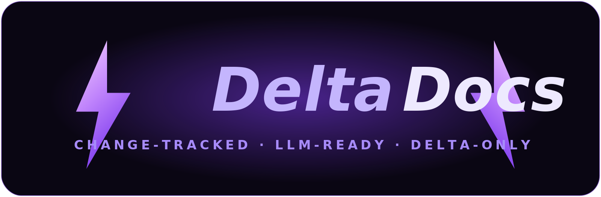

<div align="center">



<h3>Docs in. <em>Only what changed</em> out.</h3>

<p>
Turn any documentation site into clean, chunked, hash-stamped, <b>LLM-ready</b> output —<br>
then re-index <b>only the chunks that actually changed</b>, so your RAG stays fresh<br>
without paying to re-embed the entire corpus on every run.
</p>

<p>
  <a href="https://github.com/MayankSinghRaghav/DeltaDoc/actions/workflows/ci.yml"></a>
  
  
  
  
</p>

<p>
  <a href="#-quickstart"><b>Quickstart</b></a> ·
  <a href="#-how-it-works"><b>How it works</b></a> ·
  <a href="#-features"><b>Features</b></a> ·
  <a href="#-integrations"><b>Integrations</b></a> ·
  <a href="#-output"><b>Output</b></a> ·
  <a href="#%EF%B8%8F-roadmap"><b>Roadmap</b></a>
</p>

</div>

---

## 💡 Why DeltaDocs?

If you run a RAG chatbot or AI agent over **someone else's docs**, you're stuck choosing between two bad options:

<table>
<tr>
<td width="50%" valign="top">

#### ❌ Re-crawl + re-embed everything
You pay for embeddings that scale with your **total page count** — on a nightly schedule — even when almost nothing changed.

</td>
<td width="50%" valign="top">

#### ❌ Let the index go stale
Your bot confidently returns a **deprecated API signature** or a config flag that was removed three releases ago.

</td>
</tr>
</table>

Great one-shot tools (Firecrawl, Crawl4AI) turn a URL into clean markdown. **None of them does cheap, scheduled _diffing_.** That's the gap DeltaDocs fills:

> Every chunk carries a **SHA-256 over _normalized_ text**, so a re-run emits **only the chunks that actually changed** — and ships them straight to your vector store.

Because the hash ignores whitespace and formatting noise, an unchanged page produces **zero** changes on re-run. You only ever re-embed real edits.

---

## 🚀 Quickstart

> **Prerequisites:** Python **3.10+** and Git. _(Windows PowerShell shown; on macOS/Linux use `source .venv/bin/activate`.)_

```powershell
git clone https://github.com/MayankSinghRaghav/DeltaDoc.git
cd DeltaDoc
python -m venv .venv
.venv\Scripts\activate
pip install -e ".[dev]"

pytest -q                            # 40 passing — confirms your setup
```

```powershell
# 1️⃣  one-shot crawl  ->  LLM-ready output
deltadocs https://docs.python.org/3/ --max-pages 20 -o out
#    out\chunks.jsonl · out\pages.jsonl · out\llms.txt · out\llms-full.txt

# 2️⃣  change tracking  ->  run twice with a state dir; the 2nd run writes the delta
deltadocs https://docs.python.org/3/ --max-pages 20 --state-dir .state -o out
deltadocs https://docs.python.org/3/ --max-pages 20 --state-dir .state -o out
#    out\changeset.json  ->  added / modified / removed chunks only
```

<details>
<summary><b>CLI flags & optional integrations</b></summary>

<br>

| Flag | What it does |
|---|---|
| `--max-pages N` | cap the crawl |
| `--include /docs/*` | only crawl matching paths _(repeatable)_ |
| `--exclude /blog/*` | skip matching paths _(repeatable)_ |
| `--no-robots` | ignore robots.txt |
| `--state-dir DIR` | enable change tracking across runs |
| `-o OUT` | output directory |

Add adapters as you need them:

```powershell
pip install -e ".[dev,chroma,pgvector,pinecone,mcp]"
```

</details>

---

## 🔧 How it works


1. **Crawl** the site in-domain (sitemap + links), honoring robots.txt and your include/exclude globs.
2. **Extract** each page's main content to markdown and **chunk** it by heading.
3. **Hash** every chunk over _normalized_ text — the key insight that makes diffing trustworthy.
4. **Diff** this run's chunks against the previous run's saved state → a `ChangeSet`.
5. **Deliver / enrich** — upsert changed chunks (delete removed) into your vector DB, summarize them, or ping Slack.

---

## ✨ Features

| | |
|---|---|
| 🕷️ **Polite crawler** | `httpx` + sitemap/link discovery, robots.txt, include/exclude globs, depth — static/SSG docs, no headless browser |
| 🧼 **Clean extraction** | `trafilatura` strips nav/header/footer → main-content markdown |
| ✂️ **Heading-aware chunks** | breadcrumb `heading_path`, stable `chunk_id`, token estimate |
| 🔑 **Stable hashing** | SHA-256 over _normalized_ text → trivial reformatting never looks like a change |
| 🔀 **Delta engine** | diff vs the previous run → `ChangeSet` of added / modified / removed |
| 🚚 **Delivery** | push deltas to **Chroma / pgvector / Pinecone**, or alert via **webhook / Slack** |
| 🧠 **Enrichment** | per-change LLM summary + tags (OpenAI-compatible **or** Anthropic/Claude) |
| 🤖 **MCP server** | expose `crawl_docs` / `diff_docs` as tools for AI agents |
| 📄 **llms.txt** | generates `llms.txt` + `llms-full.txt` |
| ☁️ **Two ways to run** | OSS Python CLI **and** a deployable Apify Actor (pay-per-event on changed chunks) |

---

## 🧩 Integrations

Optional, dependency-light. Wire deltas into your stack in a couple of lines:

```python
# Delivery — push the delta into your index, alert your team
from deltadocs.deliver import apply_changeset, open_chroma_collection, post_webhook

apply_changeset(changeset, open_chroma_collection("./chroma"))   # or PgVectorStore / PineconeVectorStore
post_webhook(changeset, "https://hooks.slack.com/…")

# Enrichment — one-line summary + tags per change
from deltadocs.enrich import enrich_changeset, make_anthropic_summarizer

enriched = enrich_changeset(changeset, make_anthropic_summarizer())   # or make_openai_summarizer()
```

### Workflow at a glance

| Goal | Command |
|---|---|
| Run tests | `pytest -q` |
| One-shot crawl | `deltadocs <url> -o out` |
| Crawl + diff | `deltadocs <url> --state-dir .state -o out` |
| Run the MCP server | `deltadocs-mcp` |
| Validate 10 real sites (+ JS detection) | `python scripts/run_real_sites.py --max-pages 30` |
| Test the Apify Actor locally | `apify run` |
| Deploy the Apify Actor | `apify push` |

Full GitHub + Apify publishing steps live in **[PUBLISHING.md](PUBLISHING.md)**.

---

## 📦 Output

The two core artifacts are **`ChunkRecord`** (the unit of content) and **`ChangeSet`** (the delta). Example `ChangeSet`:

```jsonc
{
  "run_at": "…",
  "prev_run_at": "…",
  "start_url": "https://docs.example.com",
  "summary": { "added": 4, "modified": 7, "removed": 2 },
  "changed_chunks": [
    {
      "change_type": "modified",
      "chunk_id": "…",
      "url": "…",
      "heading_path": ["…"],
      "text": "…",
      "chunk_hash": "sha256:…"
    }
  ]
}
```

---

## 🧪 Quality

`pytest` runs **40 deterministic, offline tests** — no keys, network, DB, or MCP needed; everything external is faked or mocked. CI runs them on **Python 3.10–3.12** on every push.

The live acceptance harness (`scripts/run_real_sites.py`) reports the non-empty-markdown rate across real docs sites and **flags likely JavaScript-rendered sites** as candidates for a future Playwright fallback.

---

## 🗺️ Roadmap

**✅ Shipped** — v1 extractor · v2 delta engine · v3 enrichment + delivery (Chroma / pgvector / Pinecone / webhook) · MCP server · CI.

**🔜 Next** _(by design, not yet built)_ — multi-vertical templates (regulatory / pricing pages, not just docs) · Playwright fallback for JS-rendered sites.

---

## 📂 Project layout

```
src/deltadocs/   schema · crawler · extract · chunk · diff · pipeline · deliver · enrich · mcp_server · cli · main
tests/           10 modules, 40 tests
scripts/         run_real_sites.py (acceptance + JS detection)
.actor/          Apify Actor config
.github/         CI
assets/          logo                  PUBLISHING.md · LAUNCH.md · llms.txt
```

---

<div align="center">

## 📄 License

[MIT](LICENSE) © 2026 **Mayank Singh Raghav**

<br>

<sub>Built for teams who'd rather re-embed <b>5 chunks</b> than <b>5,000</b>.</sub>

</div>
