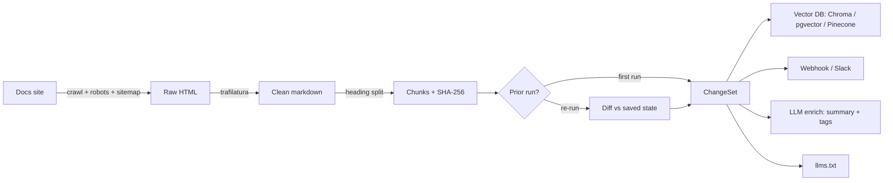

<p align="center">
  
</p>

<p align="center">
  <a href="https://github.com/MayankSinghRaghav/DeltaDoc/actions/workflows/ci.yml"></a>
  
  
  
  
</p>

<p align="center">
  <b>Turn any documentation site into clean, chunked, hash-stamped, LLM-ready output —<br>
  and re-index <i>only what changed</i>, so your RAG stays fresh without re-embedding the whole corpus.</b>
</p>

---

## The problem

If you run a RAG chatbot or AI agent over external docs, you're stuck choosing between:

- **Re-crawl + re-embed everything on a schedule** → you pay for embeddings that scale with *total pages*, even though almost nothing changed.
- **Let the index go stale** → your bot confidently returns a deprecated API signature or a removed config flag.

Great one-shot tools (Firecrawl, Crawl4AI) turn a URL into clean markdown. **None of them does cheap, scheduled *diffing*.** That's the gap DeltaDocs fills: every chunk carries a SHA-256 over *normalized* text, so a re-run emits **only the chunks that actually changed** — and ships them straight to your vector store.

## ✨ Features

| | |
|---|---|
| 🕷️ **Polite crawler** | `httpx` + sitemap/link discovery, robots.txt, include/exclude globs, depth — static/SSG docs, no headless browser |
| 🧼 **Clean extraction** | `trafilatura` strips nav/header/footer → main-content markdown |
| ✂️ **Heading-aware chunks** | breadcrumb `heading_path`, stable `chunk_id`, token estimate |
| 🔑 **Stable hashing** | SHA-256 over *normalized* text → trivial reformatting never looks like a change |
| 🔀 **Delta engine** | diff vs the previous run → `ChangeSet` of added / modified / removed |
| 🚚 **Delivery** | push deltas to **Chroma / pgvector / Pinecone**, or alert via **webhook/Slack** |
| 🧠 **Enrichment** | per-change LLM summary + tags (OpenAI-compatible **or** Anthropic/Claude) |
| 🤖 **MCP server** | expose `crawl_docs` / `diff_docs` as tools for AI agents |
| 📄 **llms.txt** | generates `llms.txt` + `llms-full.txt` |
| ☁️ **Two ways to run** | OSS Python CLI **and** a deployable Apify Actor (pay-per-event on changed chunks) |

## 🧠 How it works



1. **Crawl** the site in-domain (sitemap + links), honoring robots.txt and your globs.
2. **Extract** each page's main content to markdown and **chunk** it by heading.
3. **Hash** every chunk over *normalized* text — the key insight that makes diffing trustworthy.
4. **Diff** this run's chunks against the previous run's saved state → a `ChangeSet`.
5. **Deliver / enrich**: upsert changed chunks (delete removed) into your vector DB, summarize them, or ping Slack.

Because the hash ignores whitespace/formatting noise, an unchanged page produces **zero** changes on re-run — so you only ever re-embed real edits.

## 🖥️ Use it on your desktop

> Prerequisites: **Python 3.10+** and **Git**. (Windows PowerShell shown; macOS/Linux is the same with `source .venv/bin/activate`.)

```powershell
git clone https://github.com/MayankSinghRaghav/DeltaDoc.git
cd DeltaDoc
python -m venv .venv
.venv\Scripts\activate
pip install -e ".[dev]"

pytest -q                          # 40 passing — confirms your setup

# one-shot crawl -> LLM-ready output
deltadocs https://docs.python.org/3/ --max-pages 20 -o out
#   out\chunks.jsonl, out\pages.jsonl, out\llms.txt, out\llms-full.txt

# change tracking: run twice with a state dir; the 2nd run writes out\changeset.json
deltadocs https://docs.python.org/3/ --max-pages 20 --state-dir .state -o out
deltadocs https://docs.python.org/3/ --max-pages 20 --state-dir .state -o out
```

**CLI flags:** `--max-pages N` · `--include /docs/*` · `--exclude /blog/*` (repeatable) · `--no-robots` · `--state-dir DIR` · `-o OUT`.

Optional integrations: `pip install -e ".[dev,chroma,pgvector,pinecone,mcp]"`.

## 🔄 Workflow at a glance

| Goal | Command |
|---|---|
| Run tests | `pytest -q` |
| One-shot crawl | `deltadocs <url> -o out` |
| Crawl + diff | `deltadocs <url> --state-dir .state -o out` |
| Run the MCP server | `deltadocs-mcp` |
| Validate 10 real sites (+ JS detection) | `python scripts/run_real_sites.py --max-pages 30` |
| Test the Apify Actor locally | `apify run` |
| Deploy the Apify Actor | `apify push` |

Full GitHub + Apify publishing steps live in **[PUBLISHING.md](PUBLISHING.md)**.

## 🧩 v3 integrations (optional, dependency-light)

```python
# Delivery — push the delta into your index, alert your team
from deltadocs.deliver import apply_changeset, open_chroma_collection, post_webhook
apply_changeset(changeset, open_chroma_collection("./chroma"))   # also PgVectorStore / PineconeVectorStore
post_webhook(changeset, "https://hooks.slack.com/…")

# Enrichment — one-line summary + tags per change
from deltadocs.enrich import enrich_changeset, make_anthropic_summarizer
enriched = enrich_changeset(changeset, make_anthropic_summarizer())   # or make_openai_summarizer()
```

## 🗂️ Output

**ChunkRecord** (core artifact) and **ChangeSet** (the delta) — see PRD §5. Example `ChangeSet`:

```jsonc
{ "run_at": "…", "prev_run_at": "…", "start_url": "https://docs.example.com",
  "summary": { "added": 4, "modified": 7, "removed": 2 },
  "changed_chunks": [ { "change_type": "modified", "chunk_id": "…", "url": "…",
                        "heading_path": ["…"], "text": "…", "chunk_hash": "sha256:…" } ] }
```

## 🧪 Quality

`pytest` runs **40 deterministic, offline tests** (no keys, network, DB, or MCP needed — everything external is faked/mocked). CI runs them on Python 3.10–3.12 on every push. The live acceptance harness (`scripts/run_real_sites.py`) reports the non-empty-markdown rate across real docs sites and **flags likely JavaScript-rendered sites** as candidates for a future Playwright fallback.

## 🗺️ Roadmap

**Shipped:** v1 extractor · v2 delta engine · v3 enrichment + delivery (Chroma/pgvector/Pinecone/webhook) + MCP server · CI.

**Next (by design, not yet built):** multi-vertical templates (regulatory / pricing pages, not just docs) · Playwright fallback for JS-rendered sites.

## 📂 Project layout

```
src/deltadocs/   schema · crawler · extract · chunk · diff · pipeline · deliver · enrich · mcp_server · cli · main
tests/           10 modules, 40 tests
scripts/         run_real_sites.py (acceptance + JS detection)
.actor/          Apify Actor config        .github/  CI
assets/          logo                       PUBLISHING.md · LAUNCH.md · llms.txt
```

## 📄 License

[MIT](LICENSE) © 2026 Mayank Singh Raghav
